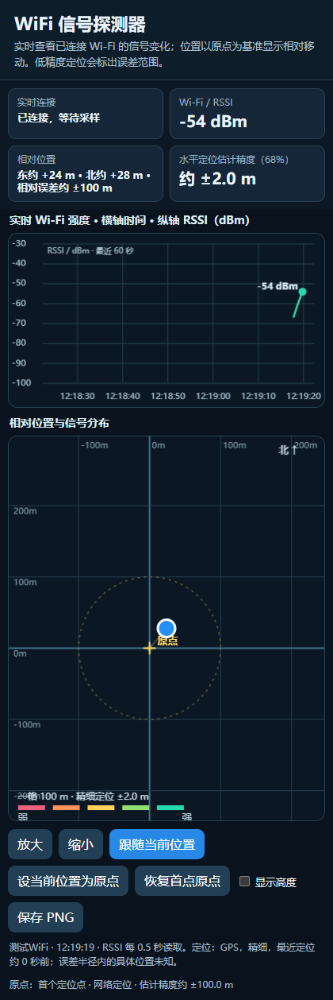

# WiFi 信号探测器

## 项目故事：从找回无人机到开源工具

### S · 情境

我们的无人机丢失了，但手机仍能收到它发出的 Wi‑Fi 信号。我们不知道无人机的确切位置，也没有房间或场地的地图。

### T · 任务

我们需要边走边观察信号强度的变化，判断朝哪个方向搜索更有希望，并尽可能记录走过的位置，逐步缩小寻找范围。

### A · 行动

于是做了这个 Android 工具。手机连接无人机的 Wi‑Fi 后，App 每约 0.5 秒读取一次当前 RSSI，用实时曲线显示信号变化；同时用首个定位点或手动设置的点作为原点，画出相对位置，并标出定位误差。搜索时沿不同方向移动，比较信号是否持续增强，再到强信号区域近距离排查。

### R · 结果

我们最终找回了无人机，并把寻找过程中使用的工具整理成这个开源项目，供遇到类似情况的人使用。**信号变强可以帮助缩小搜索范围，但单个 Wi‑Fi 信号不能直接算出无人机的精确距离或方位。**墙体、遮挡、天线朝向和多径反射都会影响 RSSI；找回无人机是结合曲线、移动路线和现场观察完成的。

*上图为界面示意，位置与信号数据为模拟值。*

## 功能与使用

这是独立 Android APK，无需 Termux。采集页面在 APK 内；同一局域网设备也可以通过 App 显示的带随机密钥链接查看。

- 每约 0.5 秒读取一次**已连接 Wi‑Fi** 的系统 RSSI，通过内置 WebSocket 实时推送。时序图横轴为时间，纵轴为原始 dBm，不做平滑或虚构小数精度。Android 和无线芯片决定底层 RSSI 的实际刷新频率。
- 使用 GPS 与网络定位中较新的、估计误差较小的结果。默认以首个定位点为原点，显示后续东西、南北方向的相对位移；可把当前定位点设为新原点，或恢复首点原点。手动原点保存在本机浏览器存储中。
- 各精度等级的位置都可绘制。点的透明度表示定位质量，蓝色虚线圆表示最新定位的估计水平误差半径。图上距离刻度不是精度承诺；低精度轨迹只能作示意。
- 可选 GPS 高度剖面，可将时序图、位置图一起导出 PNG。采样历史存于 App 私有存储，停止采集不会删除历史，卸载 App 会删除历史。

## 安装与使用

从 [最新 Release](https://github.com/100apps/wifi-signal-detector/releases/latest) 下载 `wifi-signal-detector.apk`，安装后授权**精确位置**，保持 Wi‑Fi 和系统定位开启。先让手机连接要寻找的设备发出的 Wi‑Fi，再打开 App。画面上方持续显示已连接 Wi‑Fi 的强度曲线；位置图在获得首个定位后出现。点击“设当前位置为原点”可以从当前位置重新观察相对移动。

室内网络定位可能偏差数十米甚至更多。Android 报告的水平精度是 **68% 置信半径**，不是误差上限。当前手机若只有 GPS/网络定位，不保证房间内 1 米定位。相对位置图会始终显示来源和估计误差，请按其精度判断轨迹是否可信。高度也取决于手机是否提供具有足够垂直精度的 GPS 数据。

同一 Wi‑Fi 下其他设备可打开 App 显示的 `http://手机IP:8765/?key=...`。链接中的随机密钥用于限制访问，请只分享给可信设备。局域网连接是 HTTP，不适合跨不可信网络暴露。App 不向外部服务器上传位置或 RSSI。详情见[隐私与安全说明](SECURITY.md)。

## 构建

需要 JDK 17、Android SDK Platform 35 和 Build Tools 35.0.1。Linux/macOS 设置 `ANDROID_HOME` 后运行 `bash build.sh`；Windows 运行 `pwsh -File build.ps1`。Windows 脚本也支持先前的 `PHONE_WIFI_SDK` 目录布局。输出为 `wifi-signal-detector.apk`。

本地 `build.sh` 在没有正式签名参数时会在被 Git 忽略的 `.signing/debug.jks` 生成开发签名。发布构建使用 `SIGNING_KEYSTORE` 与 `ANDROID_KEYSTORE_PASSWORD`。正式签名密钥不在仓库内；开发签名 APK 不能覆盖安装 Release APK。图标源文件在 [`artwork/icon.svg`](artwork/icon.svg)，打包图标是 `res/drawable-nodpi/ic_launcher.png`。

## 自动发布

每次推送到 `master`，GitHub Actions 从源码构建、使用项目正式签名、验签，并创建一个带 APK 附件的 Release。也可在 Actions 页面手动触发。维护者需要配置仓库 Secrets：

- `ANDROID_KEYSTORE_BASE64`：正式 JKS 文件的 Base64 内容。
- `ANDROID_KEYSTORE_PASSWORD`：JKS 密码。

历史版本的正式签名已保留供本仓库 CI 使用，所以 Release APK 可以覆盖升级此前安装的版本。第三方 Fork 若用自己的签名，需要先卸载旧签名版本。

## 开源协议

[MIT](LICENSE)。欢迎阅读[贡献指南](CONTRIBUTING.md)和[更新记录](CHANGELOG.md)。
